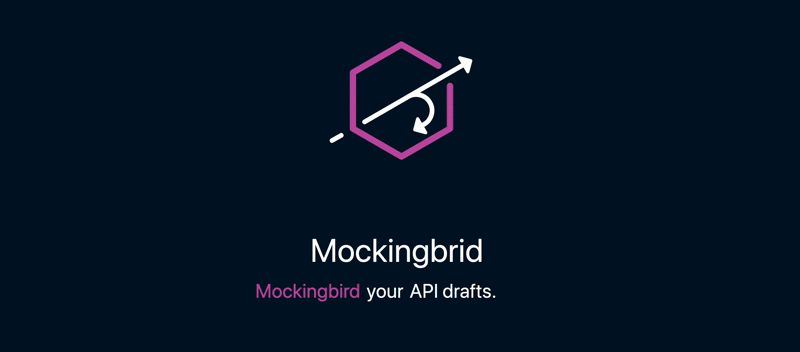
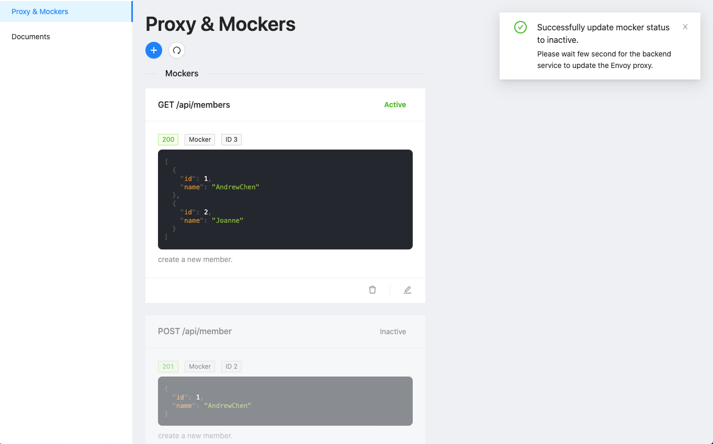

# Mockingbird



An easy API proxy base on Envoy, Envoy management server and web GUI administrator.

## Features

* Mock single API with custom JSON.
* Proxy non-mock API to your original service.
* Operate above mentioned features on a simple GUI.

## Getting Started

### Setup Locally

* Install [Docker](https://www.docker.com/)
* Install [Docker Compose](https://docs.docker.com/compose/install/)

### Start Mockingbird With Docker Image

* [DockerHub](https://hub.docker.com/repository/docker/andrewchen20/mockingbird)
* Here is the [example](https://github.com/PolarBearAndrew/mockingbird-example)

```yaml
version: '3.4'
services:
  mockingbird-server:
    image: 'andrewchen20/mockingbird:latest'
    ports:
      - '4000:4000'
      - '3000:3000'
    networks:
      - mockingbird-internal
  envoy:
    image: 'envoyproxy/envoy-dev:b055dd082c0a49525a97cea6604ac1323a55d2fb'
    volumes:
      - './envoy_config.yaml:/etc/envoy/envoy.yaml'
    ports:
      - '10000:10000'
      - '10001:10001'
    networks:
      - mockingbird-internal
networks:
  mockingbird-internal:
    name: mockingbird-internal
```

### Start Mockingbird With Source Coe

Clone this repository.

```sh
$ sh start.sh
# or 
$ sh restart.sh
```

You will see two container been started with `docker ps`.

1. `envoyproxy/envoy-dev` - Mockingbird service base on this Envoy proxy.
1. `mockingbird` - Include [Envoy xds](https://www.envoyproxy.io/docs/envoy/latest/intro/arch_overview/operations/dynamic_configuration), Mockingbird operation API and admin GUI web server.

Open your browser [http://localhost:3000/admin](http://localhost:3000/admin) and press the `Get Start` button.



## Documentation

Not necessary right now. When we start provide more features, we will provide documents.

## Packages

### Related

* [envoyproxy](https://www.envoyproxy.io/docs/envoy/latest/start/start#quick-start-to-run-simple-example)
* [envoyproxy/go-control-plan](https://github.com/envoyproxy/go-control-plane)
* [ant-design](https://github.com/ant-design/ant-design/)
* [create-react-app](https://github.com/facebook/create-react-app)

## Contributing

> Welcome!! This is my first real open-source project, please mail me your thoughts!

* My personal `chenpoanandrew@gmail.com`

## License

MIT
